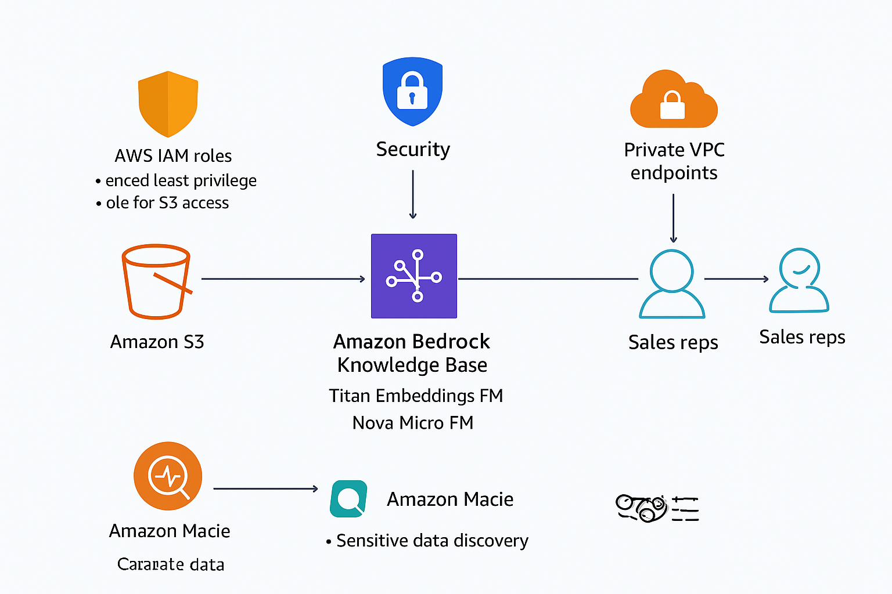
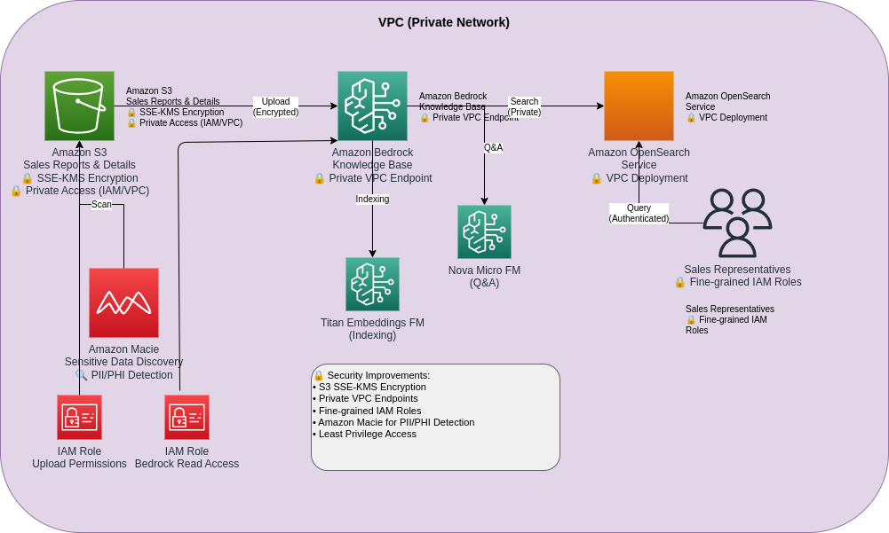

# 🛡️ Secure AI-Powered Knowledge System on AWS

A **secure, AI-driven knowledge management system** built on **Amazon Bedrock**, **Amazon OpenSearch**, and **Amazon S3** — designed under the **AWS Well-Architected Framework (Security Pillar)**.

This repository demonstrates how to integrate **AI embeddings**, **secure ingestion pipelines**, and **cloud-native protections** into one enterprise-grade architecture.

---

## 🧭 Overview

This solution allows sales teams to query large volumes of sales data securely, using:
- **Titan Embeddings FM** for indexing  
- **Nova Micro FM** for Q&A  
- **Amazon OpenSearch** for semantic search  
- **IAM, KMS, Macie, and VPC** for data protection  

---

## 🧱 Architecture Diagram

### 🔒 Secure AWS Architecture (Detailed)


### 🧩 Conceptual Security Flow


---

## 🔐 Core Security Controls

| Security Layer | AWS Service | Role |
|----------------|-------------|------|
| Data Encryption | **Amazon S3 + KMS** | Encrypts sales data at rest |
| Identity & Access | **AWS IAM** | Enforces least-privilege roles |
| Private Connectivity | **VPC Endpoints** | Blocks public data exposure |
| Threat Detection | **Amazon GuardDuty** | Monitors suspicious activity |
| Sensitive Data Discovery | **Amazon Macie** | Detects PII/PHI automatically |
| Logging & Audit | **AWS CloudTrail** | Captures API-level events |

---

## ⚙️ Pipeline Summary

1. Sales data uploaded to **Amazon S3** (encrypted with **SSE-KMS**)  
2. **Amazon Macie** scans for sensitive content  
3. **AWS Lambda** triggers document processing  
4. **Amazon Bedrock (Titan FM)** generates embeddings  
5. **Amazon Bedrock (Nova FM)** enables question answering  
6. **Amazon OpenSearch** provides vector search  
7. **IAM roles + VPC endpoints** ensure zero public exposure  

---

## 🧰 Terraform Example (Security + S3)

```hcl
resource "aws_s3_bucket" "sales_data" {
  bucket = "secure-sales-data"
  server_side_encryption_configuration {
    rule {
      apply_server_side_encryption_by_default {
        sse_algorithm = "aws:kms"
      }
    }
  }
  versioning {
    enabled = true
  }
}

resource "aws_vpc_endpoint" "bedrock_endpoint" {
  vpc_id            = aws_vpc.main.id
  service_name      = "com.amazonaws.${var.region}.bedrock"
  vpc_endpoint_type = "Interface"
  security_group_ids = [aws_security_group.vpc_sg.id]
}
```

🧠 Observability & Compliance
Amazon CloudWatch: Monitors metrics and embedding jobs

AWS CloudTrail: Tracks API-level activity

Amazon GuardDuty: Detects threats and anomalies

Amazon SNS: Sends automated security alerts

💸 Cost Optimization
S3 lifecycle policies to archive old data

Use Bedrock on-demand model scaling

Batch embedding jobs for cost efficiency

Turn off idle pipelines automatically

🌱 Sustainability Practices
Consolidate compute within one AWS region

Use adaptive compute scaling in Bedrock

Remove outdated embeddings regularly

📚 Further Reading
🧩 AWS Well-Architected Framework: Security Pillar

☁️ Amazon Bedrock Documentation

🧠 Medium Article: How We Built a Secure AI Knowledge System on AWS (Add your Medium link here)

⚙️ Terraform Docs: Terraform AWS Provider

🧑‍💻 Author
David Kljajo
Cloud Solutions Architect | AWS Security Specialist
🔗 https://www.linkedin.com/in/david-kljajo/
 🧠 https://www.linkedin.com/in/david-kljajo/
 💼 https:/dkljajo.github.io
